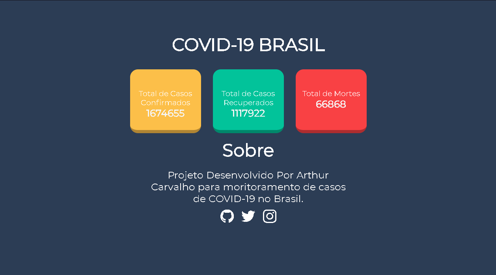

  

<h1 align="center">Covid Cases On Brazil</h1>
 <h1 align="center" href="https://artiwnl.github.io/CovidCasesOnBrazil/"> Aplicação </h1>

   
    
   

<h1 align="center">Objetivo</h1>

  <strong> A aplicação tem como objetivo apresentar o número de casos, recuperações e óbitos pelo COVID-19 no Brasil</strong>

<h1 align="center">Sobre</h1>

  <strong> Aplicação Desenvolvida totalmente por <a href="https://www.instagram.com/artie.baka/">Arthur Carvalho</a></strong>

